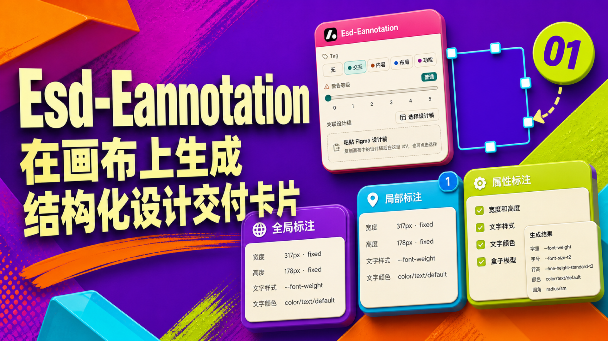

# Esd-Eannotation

在 Figma 画布上生成清晰、结构化的设计交付卡片。

Create clear, structured design handoff cards directly on the Figma canvas.

[中文](#中文) | [English](#english)



---

<a id="中文"></a>
## 中文

### 项目简介

Esd-Eannotation 是一款免费的 Figma 设计交付插件。选择一个图层后，设计师可以输入说明、添加图片并勾选需要展示的属性；插件会根据图层层级创建全局交付卡片，或为 Frame、Component、Instance 内的元素创建带编号的局部卡片。

插件生成的是保留在画布中的可见 Figma 节点，不会创建或替代 Figma 原生 Annotations。

### 核心能力

- 自动识别全局与局部交付场景，并为局部卡片生成对应的编号标记。
- 支持文字说明、本地图片上传、剪贴板图片和关联设计稿。
- 支持宽高、最小/最大尺寸、填充、描边、文字样式、文字颜色、圆角和盒模型。
- 属性展示优先使用绑定变量，其次使用样式，最后展示原始值。
- 为同一元素继续追加内容，避免重复创建编号。
- 无网络访问，不向外部服务发送 Figma 文件内容。

### 快速开始

#### 环境要求

- Figma Desktop
- Node.js
- pnpm `11.19.0`

#### 安装与构建

```sh
pnpm install --frozen-lockfile
pnpm build
```

构建会生成 `dist/main.js` 和单文件 `dist/ui.html`。在 Figma Desktop 中选择：

```text
Plugins > Development > Import plugin from manifest...
```

然后导入项目根目录下的 [`manifest.json`](manifest.json)。

### 使用方法

1. 在 Figma 画布中只选择一个需要标注的元素。
2. 打开 Esd-Eannotation，输入文字、添加图片，或选择关联设计稿与属性标注。
3. 点击「创建标注」。

顶层元素会在右侧生成全局卡片；位于 Frame、Component 或 Instance 内的元素会在源节点右上角生成编号徽标，并在外层 Frame 右侧生成局部卡片。Section 不决定标注类型，但生成的节点会保留在对应 Section 中。

关联设计稿会移动原始节点而不是创建副本；添加的图片会保持原始比例。再次标注同一源元素时，新内容会追加到已有卡片。

#### 限制与兼容性

- 当前仅支持单选。
- 为继续关联已有标注，插件会扫描当前 Page 中的兼容标注节点。
- 粘贴 Figma 节点链接时，插件会在当前文件中按节点 ID 定位设计稿。
- 为兼容旧文件，内部 plugin data 键 `anno`、`Eannotation / …` 图层名和旧版 `Anno / …` 识别分支会继续保留；公开产品名称始终为 Esd-Eannotation。

### 项目结构

```text
src/App.tsx                    插件 UI
src/plugin/main.ts             Figma 主线程、选择分析和画布节点创建
src/plugin/properties.ts       属性采集和格式化
src/shared/messages.ts         UI 与主线程消息类型
scripts/inline-ui.mjs          将 UI 资源内联为单个 Figma HTML
scripts/build-main.mjs         构建 Figma 主线程脚本
scripts/check-brand-compat.mjs 校验品牌与旧数据兼容约束
community/                     Community 文案、隐私说明与视觉素材
manifest.json                  Figma 插件清单
```

### 开发与验证

启动开发服务器：

```sh
pnpm dev
```

运行完整检查：

```sh
pnpm check:brand-compat
pnpm typecheck
pnpm test
pnpm lint
pnpm build
```

生产构建会验证 UI 资源全部内嵌，并将网络访问限制为 `allowedDomains: ["none"]`。

### 隐私与支持

- 数据处理详情见 [`community/privacy-policy.md`](community/privacy-policy.md)。
- 常见问题与反馈模板见 [`community/support-template.md`](community/support-template.md)。
- 支持邮箱：`yueqi@tsign.cn`。

[English](#english) · [返回顶部](#esd-eannotation)

---

<a id="english"></a>
## English

### Overview

Esd-Eannotation is a free Figma plugin for structured design handoff. After selecting one layer, designers can add notes, images, and selected property specs. The plugin creates a global handoff card from the layer hierarchy or a numbered local card for an element inside a Frame, Component, or Instance.

It creates visible Figma canvas nodes and does not create or replace native Figma Annotations.

### Features

- Automatically identifies global and local handoff contexts and creates matching numbered markers for local cards.
- Supports text notes, local-image uploads, clipboard images, and related designs.
- Supports dimensions, min/max size, fills, strokes, typography, text color, radius, and box model.
- Displays bound variables first, followed by styles, then raw values.
- Appends content to the same source element instead of creating duplicate numbers.
- Has no network access and sends no Figma file content to external services.

### Quick Start

#### Prerequisites

- Figma Desktop
- Node.js
- pnpm `11.19.0`

#### Install and build

```sh
pnpm install --frozen-lockfile
pnpm build
```

The build creates `dist/main.js` and a standalone `dist/ui.html`. In Figma Desktop, choose:

```text
Plugins > Development > Import plugin from manifest...
```

Then import [`manifest.json`](manifest.json) from the project root.

### Usage

1. Select exactly one element on the Figma canvas.
2. Open Esd-Eannotation, enter text, add images, or choose related designs and property annotations.
3. Click **创建标注** (Create annotation).

A top-level element receives a global card to its right. An element inside a Frame, Component, or Instance receives a numbered badge at the source node's top-right corner and a local card to the outer Frame's right. A Section does not determine annotation type, but generated nodes remain inside the corresponding Section.

Related designs move the original nodes instead of creating copies, and added images retain their original aspect ratio. Annotating the same source element again appends content to its existing card.

#### Limits and compatibility

- The plugin currently supports single selection only.
- To continue existing annotations, it scans compatible annotation nodes on the current Page.
- When a Figma node link is pasted, the plugin resolves its node ID within the current file.
- For backward compatibility, the internal plugin-data key `anno`, `Eannotation / …` layer names, and legacy `Anno / …` recognition branches remain in place; the public product name is always Esd-Eannotation.

### Project Structure

```text
src/App.tsx                    Plugin UI
src/plugin/main.ts             Figma main thread, selection analysis, and canvas-node creation
src/plugin/properties.ts       Property collection and formatting
src/shared/messages.ts         UI and main-thread message types
scripts/inline-ui.mjs          Inlines UI assets into one Figma HTML file
scripts/build-main.mjs         Builds the Figma main-thread script
scripts/check-brand-compat.mjs Checks branding and legacy-data compatibility
community/                     Community copy, privacy notice, and visual assets
manifest.json                  Figma plugin manifest
```

### Development and Verification

Start the development server:

```sh
pnpm dev
```

Run the full verification set:

```sh
pnpm check:brand-compat
pnpm typecheck
pnpm test
pnpm lint
pnpm build
```

The production build verifies that UI resources are fully inlined and restricts network access to `allowedDomains: ["none"]`.

### Privacy and Support

- See [`community/privacy-policy.md`](community/privacy-policy.md) for data-processing details.
- See [`community/support-template.md`](community/support-template.md) for troubleshooting and the issue template.
- Support: `yueqi@tsign.cn`.

[中文](#中文) · [Back to top](#esd-eannotation)
